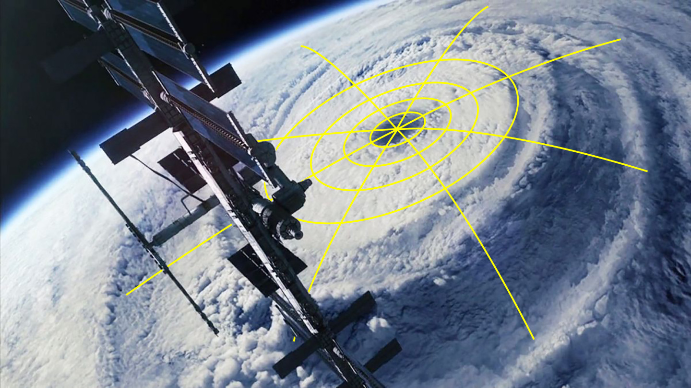
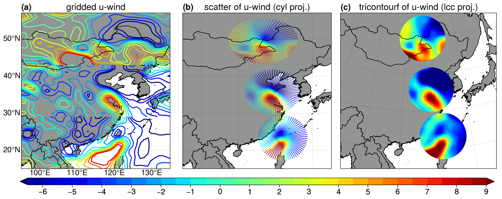
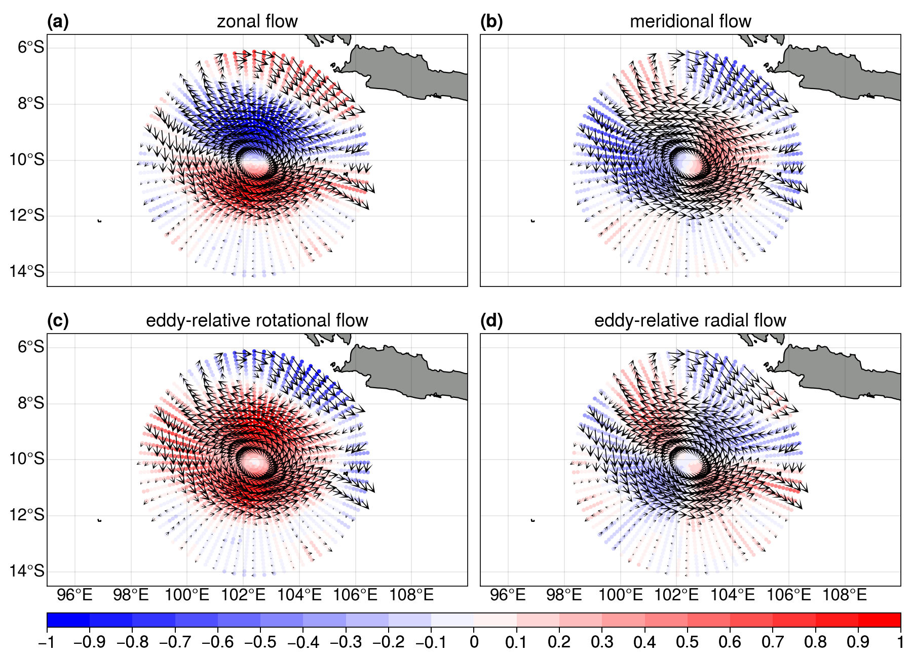

# xvortices



## 1. Introduction
`xvortices` is a python package built on [`xarray`](http://xarray.pydata.org/en/stable/) (starts with an `x`), targeting at extracting information about moving vortices from lat/lon gridded datasets.  Moving vortices include [tornado](https://en.wikipedia.org/wiki/Tornado), [tropical cyclone](https://en.wikipedia.org/wiki/Tropical_cyclone), [extratropical cyclone](https://en.wikipedia.org/wiki/Extratropical_cyclone), [polar vortex](https://en.wikipedia.org/wiki/Polar_vortex) in the atmospheric context, as well as [mesoscale eddy](https://en.wikipedia.org/wiki/Eddy_(fluid_dynamics)) and [ocean gyre](https://en.wikipedia.org/wiki/Ocean_gyre) in the oceanic context.  These moving vortices are usually described in a moving (also known as quasi-Lagrangian) cylindrical coordinate.  As the coordinate system moves on the spherical earth as a whole, one could take a view of the vortex dynamics from a quasi-Lagrangian perspective instead of the traditional Eulerian perspective.

Basically, this package would do the following jobs:
- accept an `xarray.Dataset` (or a list of `xarray.DataArray`) as an input dataset, usually in a fashion of lat/lon grid;
- interpolate the data onto the cylindrical coordinates once the origin of the moving coordinate is given (this is naturally done using the builtin function of `xarray`);
- return the interpolated fields, including scalars and vectors;
- re-project the vectors onto the azimuthal/radial directions;

With this tool, one can perform quasi-Lagrangian diagnoses of the structure, evolution, budget, intensity etc in a perspective different from the Eulerian one.

---

## 2. How to install
**Requirements**
`xvortices` is developed under the environment with `numpy` (=version 1.15.4), and `xarray` (=version 0.15.1).  Older versions of these packages are not well tested.


**Install from github**
```
git clone https://github.com/miniufo/xvortices.git
```

---

## 3. Examples
### 3.1 A moving tropical cyclone
Here we demonstrate an application to the case of a moving tropical cyclone (TC) over the western North Pacific.  One may need [`besttracks`](https://github.com/miniufo/besttracks) to load TC best-track data and cooperate with `xvortices`:
```python
import xarray as xr
from xvortices.xvortices import load_cylind, project_to_cylind

azimNum, radiNum, radMax = 72, 31, 6

# variables inside are [u, v, w, h]
dset = xr.open_dataset('gridded.nc')

# one can obtain tropical cyclone (TC) best-track
# data from the `besttracks` package
olon  = TC.get_as_xarray('lon') # timeseries of center longitudes
olat  = TC.get_as_xarray('lat') # timeseries of center latitudes
uovel = TC.get_as_xarray('uo')  # timeseries of center u-vel
vovel = TC.get_as_xarray('vo')  # timeseries of center v-vel

[u, v, w, h], lons, lats, etas = load_cylind(dset, olon=olon, olat=olat,
                                             azimNum=azimNum, radiNum=radiNum,
                                             radMax=radMax)
urel = u - uovel # storm-relative u
vrel = v - vorel # storm-relative v

# storm-relative azimuthal/radial winds
uaz, vra = project_to_cylind(urel, vrel, etas)
```

More details can be found at this [TC notebook](./notebooks/1.TCExample.ipynb).



---

### 3.2 A moving mesoscale eddy
This is a mesoscale eddy case (todo...).
```python
# todo...
```

More details can be found at this [eddy notebook](./notebooks/2.EddyExample.ipynb).


